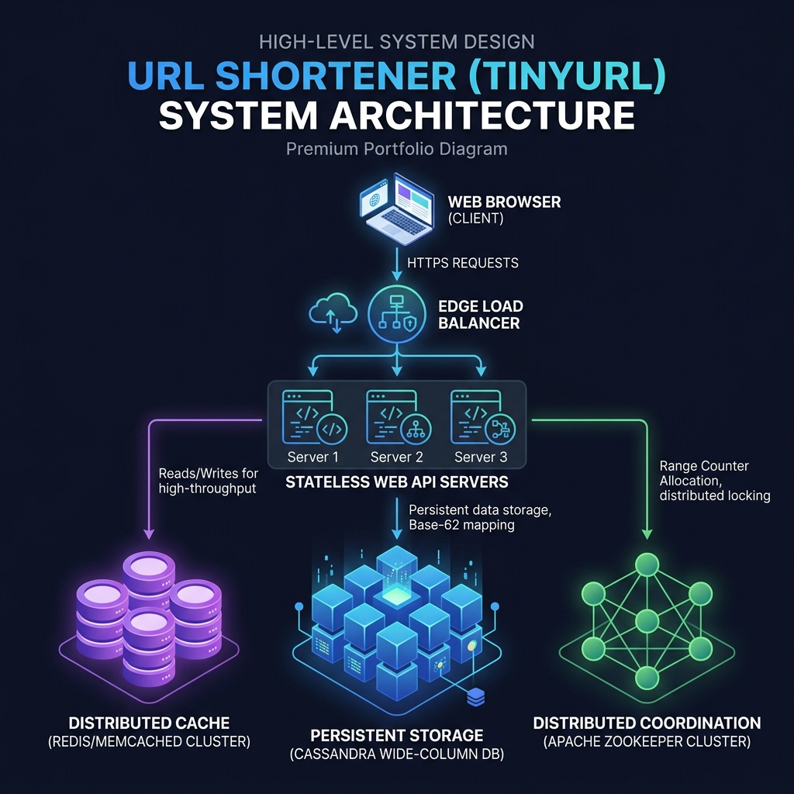
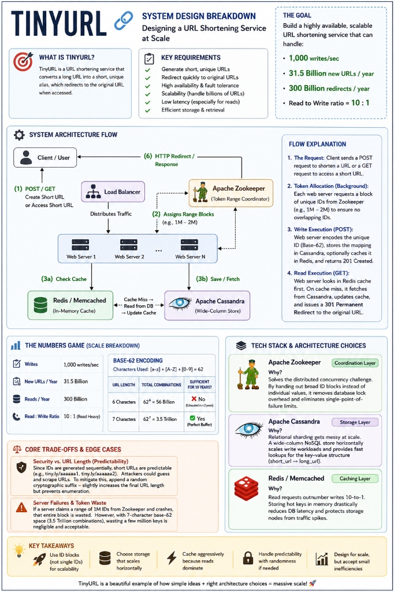
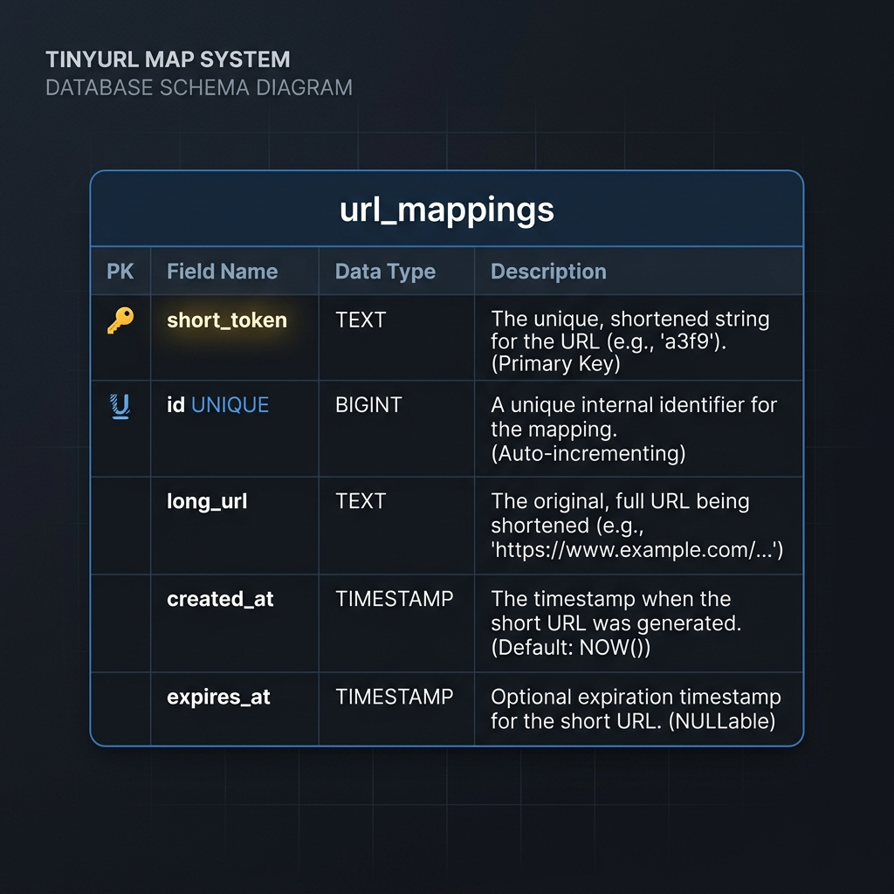

# System Design: Distributed URL Shortener (TinyURL)

This is a comprehensive, production-grade system design specification for a distributed URL Shortener (TinyURL) service. It is structured to follow professional engineering portfolio guidelines.

---

## 1. Problem Statement

A URL shortener converts long, complex URLs into shortened, unique tokens. When accessed, these tokens redirect users back to the original long URLs. Designing this at global scale requires coordinating sequence numbering across stateless servers without centralization bottlenecking.

### Scale of System
* **Write Generation Volume**: 1,000 writes/sec
* **Read Redirection Volume**: 10,000 reads/sec (10:1 Read-to-Write ratio)
* **Design Horizon**: 10 years of continuous growth

---

## 2. Functional Requirements

* **Short Link Generation**: Given a long URL, return a unique shortened token.
* **HTTP Redirect (301 Routing)**: Resolve shortened tokens and redirect clients to the destination URL.
* **Custom Aliases**: Support user-provided tokens (optional, overriding counter allocation).
* **Link Expiration**: Support custom expiration thresholds, deleting dead mappings automatically.

---

## 3. Non-Functional Requirements

* **Ultra-Low Read Latency**: Redirection lookup must complete in sub-10ms.
* **Highly Available (AP Model)**: Read availability must target 99.999% ($5\times9$s) availability.
* **No Single Point of Failure (SPOF)**: Fully clustered and redundant architecture.
* **Format Predictability Protection**: Short URL strings must not be easily guessable.

---

## 4. Capacity Estimation

### Request Volume Calculations
* **Writes per second**: $1,000\text{ writes/sec}$
* **Writes per year**:
  $$1,000\text{ writes/sec} \times 86,400\text{ sec/day} \times 365\text{ days/year} \approx 31.536\text{ Billion writes/year}$$
* **Reads per second**: $10,000\text{ reads/sec}$
* **Reads per year**:
  $$31.536\text{ Billion writes/year} \times 10 \approx 315.36\text{ Billion reads/year}$$

### Storage Calculations (10-Year Horizon)
* Let average database record footprint (ID, short token, long URL, dates) = **500 Bytes**.
* Total stored records over 10 years = $315.36\text{ Billion}$.
* **Total database storage size requirement**:
  $$315.36\times10^9\text{ records} \times 500\text{ bytes} \approx 157.68\text{ Terabytes}$$

### Character Space & Encoding Analysis
Using Base-62 encoding ($[a-z, A-Z, 0-9]$), we map character slots ($N$) to token capacity:

| Token Length ($N$) | Permutation Space ($62^N$) | Lifespan (at 31.5B writes/year) | Sufficient? |
| :---: | :--- | :--- | :---: |
| **5** | $62^5 \approx 916\text{ Million}$ | $\approx 10$ days | ❌ No |
| **6** | $62^6 \approx 56.8\text{ Billion}$ | $\approx 1.8$ years | ❌ No |
| **7** | $62^7 \approx 3.52\text{ Trillion}$ | $\approx 111.6$ years | **✓ Yes** |

> [!IMPORTANT]
> A **7-character token length** ($62^7 \approx 3.52\text{ Trillion}$) is mathematically required to guarantee the service survives the 10-year design lifespan. A 6-character length would experience namespace exhaustion in less than two years.

---

## 5. High-Level Design

The architecture uses stateless API web servers backed by local distributed caches (Redis) and wide-column persistent storage (Cassandra). Coordination is handled out-of-band using Apache Zookeeper.

### System Architecture Topology


### Mindmap Breakdown


---

## 6. Database Design

Since records are immutable after creation and lookups are clean key-value point queries, the storage tier maps cleanly to a Wide-Column NoSQL Cassandra cluster.

### Database Schema Table Definition


```sql
CREATE KEYSPACE tinyurl_keyspace 
WITH replication = {'class': 'NetworkTopologyStrategy', 'us-east': 3, 'us-west': 3};

CREATE TABLE tinyurl_keyspace.url_mappings (
    short_token text,
    id bigint,
    long_url text,
    created_at timestamp,
    expires_at timestamp,
    PRIMARY KEY (short_token)
);
```

---

## 7. Deep-Dive Design Specifications

To read the modular design details, please refer to the corresponding sub-specifications:

* 📄 **[API Interface Contracts](file:///Users/shriyashsahu/.gemini/antigravity/scratch/System-Design/01-tinyurl/api-design.md)**: Full REST API specs for URL shortening and redirection lookups.
* 📄 **[Distributed Scaling Strategy](file:///Users/shriyashsahu/.gemini/antigravity/scratch/System-Design/01-tinyurl/scaling-notes.md)**: Zookeeper range reservation, multi-tier caches, rate-limiting, and Format-Preserving Encryption.
* 📄 **[Bottlenecks & Tradeoffs Analysis](file:///Users/shriyashsahu/.gemini/antigravity/scratch/System-Design/01-tinyurl/tradeoffs.md)**: In-depth assessment of Cassandra vs. Relational Sharding, Zookeeper ranges vs. distributed locks, and 301 vs. 302 HTTP redirect routing.

---

## 8. Technologies Used

* **Frontend**: Next.js (Admin link management console and dashboard).
* **Backend**: FastAPI / Go (Stateless API servers optimized for lightweight redirect routing).
* **Distributed Coordination**: Apache Zookeeper (Range block leases for sequence generators).
* **Distributed Cache**: Redis Cluster (In-memory cached mappings for sub-2ms read lookups).
* **Persistent Data Layer**: Apache Cassandra (Wide-Column NoSQL store for horizontal scaling).
* **Rate Limiting**: Kong API Gateway (Redis Token Bucket policies).
* **Telemetry Analytics**: Apache Kafka & Spark (Real-time tracking of regional click events).

---

## 9. Key Learnings & Lessons Learned

1. **Decouple Coordination from Hot Path**: Moving Zookeeper counter check-ins out of the per-request transaction loop and using range leases ($1,000,000$ values at a time) is critical to avoiding centralized synchronization locks.
2. **AP over CP Model**: In a URL shortener, read availability is paramount. Wide-Column NoSQL (Cassandra) database replication fits this AP model perfectly.
3. **Format-Preserving Encryption**: Sequential integer mapping makes short URLs highly guessable. Bijective encryption (like a Feistel Cipher) is necessary to scramble output keys before Base-62 encoding to prevent scraping.
4. **Caching Strategy Matters**: Local Edge redirects (HTTP 301 caching in browser DNS) dramatically reduce system read workloads, but require balancing against client metrics tracking requirements.
