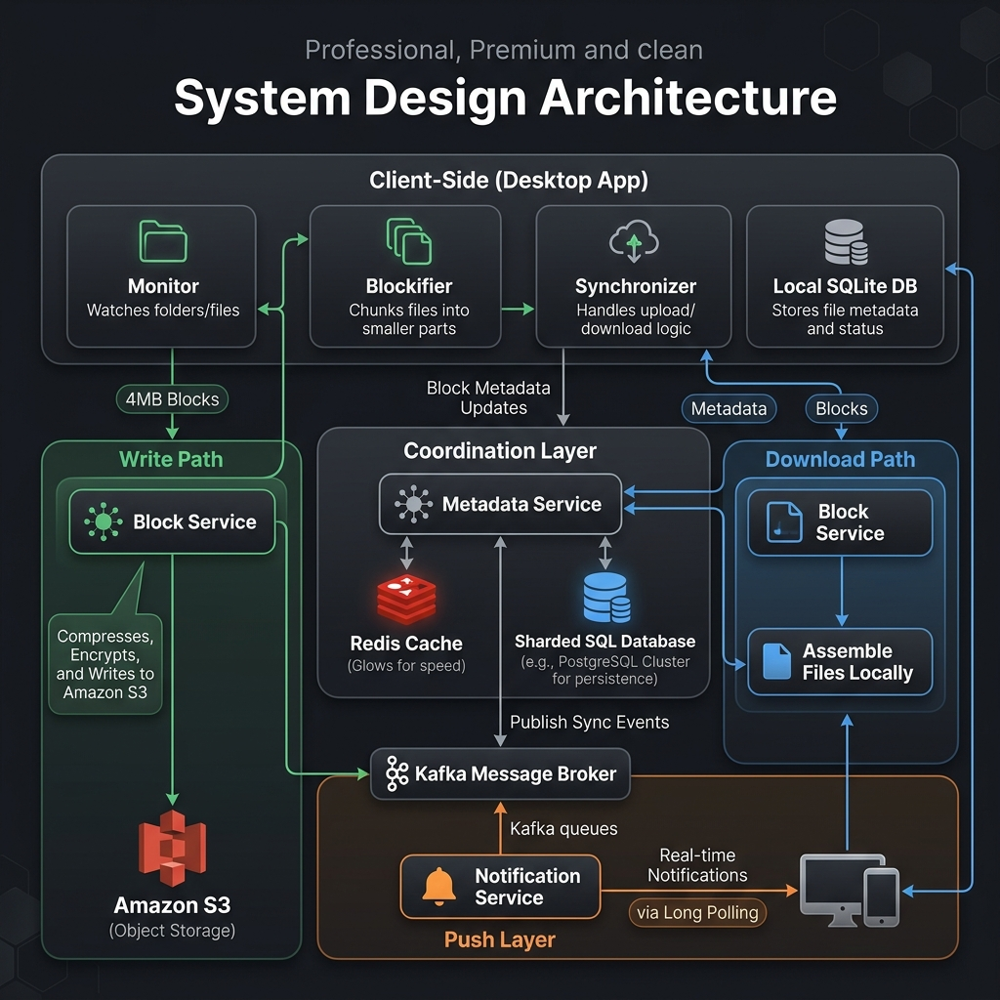
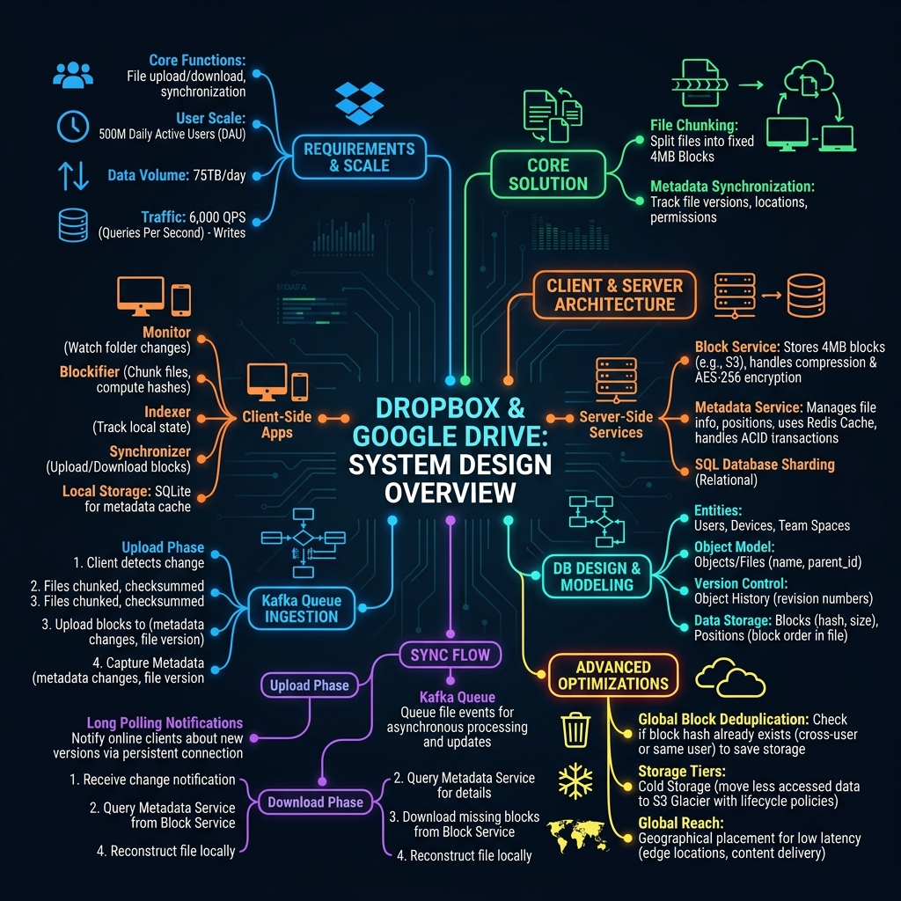
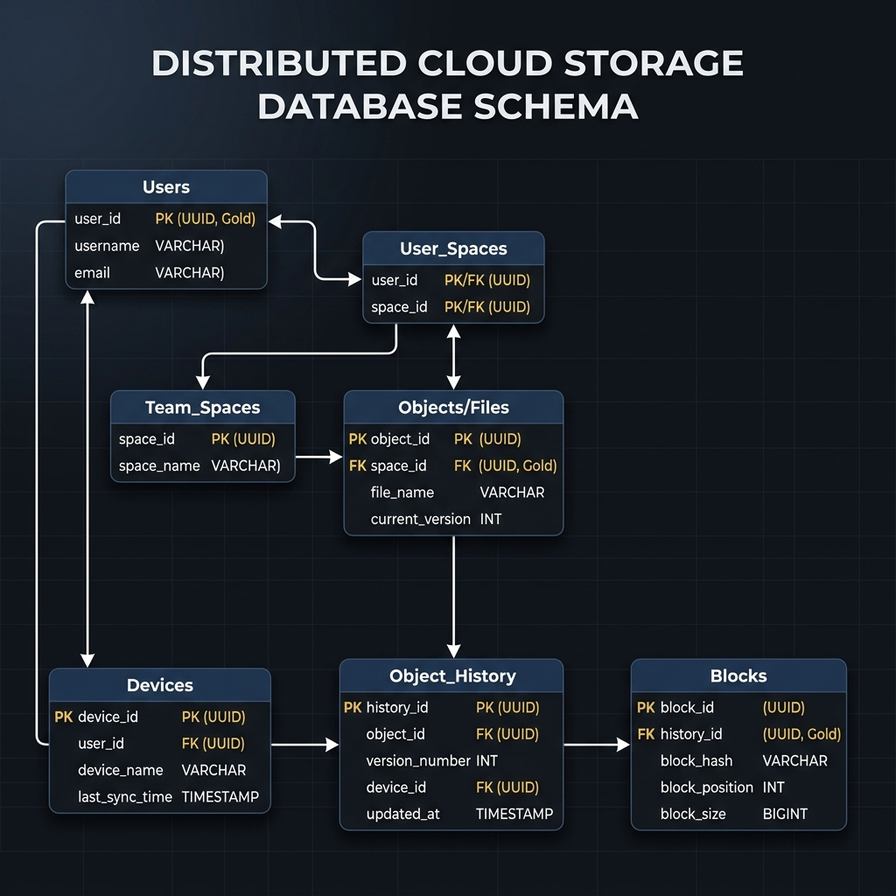

# System Design: Dropbox / Google Drive

This is a comprehensive, production-grade system design specification for a distributed cloud storage and synchronization system like Dropbox or Google Drive. It is structured to follow professional engineering portfolio guidelines.

---

## 1. Problem Statement

A distributed cloud storage system lets users store files, folders, and media in the cloud, syncing updates automatically across multiple devices (desktops, phones, tablets). Designing this requires handling file changes efficiently without saturating upload bandwidth.

### Scale of System
* **Daily Active Users (DAU)**: 500 Million
* **Upload Throughput**: $\approx 6,000\text{ writes/sec}$ average write QPS
* **Design Horizon**: 10 years of continuous data retention

---

## 2. Functional Requirements

* **File Upload/Download**: Read/write binary files to cloud storage safely.
* **Cross-Device Sync**: Detect updates on one client and automatically sync changes to all other authorized devices.
* **Workspace / Team Spaces**: Support shared team drives with directory permissions.
* **File Versioning**: Retain historical records of file changes for undo/revision lookups.

---

## 3. Non-Functional Requirements

* **Absolute Data Reliability**: File uploads must not experience data corruption or loss.
* **Low Synchronization Latency**: Changes should propagate across devices in sub-second timelines.
* **High Scalability**: Must scale to absorb petabytes of incoming data daily.
* **Storage Optimization**: Minimize storage costs using deduplication and lifecycle rules.

---

## 4. Capacity Estimation

### Request Volume Calculations
* **Daily Upload Volume**: 500 Million files/day (assuming 1 file/active user/day)
* **Average File Size**: 150 KB
* **Writes QPS (Average)**:
  $$500\text{M} \div 86,400\text{ sec/day} \approx 5,787\text{ writes/sec} \approx 6,000\text{ QPS}$$

### Storage Calculations
* **Daily Storage Influx**:
  $$500\text{M files} \times 150\text{ KB/file} \approx 75\text{ Terabytes/day}$$
* **Annual Storage Growth**:
  $$75\text{ TB/day} \times 365\text{ days/year} \approx 27.375\text{ Petabytes/year}$$
* **10-Year Storage Footprint**:
  $$27.375\text{ PB/year} \times 10\text{ years} \approx 273.75\text{ Petabytes} \approx 270\text{ Petabytes}$$

---

## 5. High-Level Design

The architecture splits files into 4 MB blocks client-side, uploading only modified blocks to S3. A lightweight local SQLite engine tracks block states, while a backend Metadata Service coordinates synchronization via Kafka and Long Polling notifications.

### System Architecture Topology


### Mindmap Breakdown


---

## 6. Database Design

We track file catalogs and block relationships inside a sharded relational database to ensure strict ACID transactions.

### Database Schema Table Definition


```sql
CREATE TABLE users (
    user_id UUID PRIMARY KEY,
    username VARCHAR(100),
    email VARCHAR(255) UNIQUE
);

CREATE TABLE devices (
    device_id UUID PRIMARY KEY,
    user_id UUID REFERENCES users(user_id),
    device_name VARCHAR(100),
    last_sync_time TIMESTAMP
);

CREATE TABLE objects (
    object_id UUID PRIMARY KEY,
    space_id UUID,
    file_name VARCHAR(255),
    current_version INT
);

CREATE TABLE object_history (
    history_id UUID PRIMARY KEY,
    object_id UUID REFERENCES objects(object_id),
    version_number INT,
    device_id UUID REFERENCES devices(device_id),
    updated_at TIMESTAMP
);

CREATE TABLE blocks (
    block_id UUID PRIMARY KEY,
    history_id UUID REFERENCES object_history(history_id),
    block_hash VARCHAR(64),
    block_position INT,
    block_size BIGINT
);
```

---

## 7. Deep-Dive Design Specifications

To read the modular design details, please refer to the corresponding sub-specifications:

* 📄 **[API Interface Contracts](file:///Users/shriyashsahu/.gemini/antigravity/scratch/System-Design/Dropbox%20/%20Google%20Drive:%20System%20Design/api-design.md)**: Specifications for block uploads, metadata sync, and long-poll subscriptions.
* 📄 **[Client/Server Block Sync](file:///Users/shriyashsahu/.gemini/antigravity/scratch/System-Design/Dropbox%20/%20Google%20Drive:%20System%20Design/scaling-notes.md)**: In-depth chunking pipelines, client-side SQLite databases, long-poll workflows, and global deduplication.
* 📄 **[Bottlenecks & Tradeoffs Analysis](file:///Users/shriyashsahu/.gemini/antigravity/scratch/System-Design/Dropbox%20/%20Google%20Drive:%20System%20Design/tradeoffs.md)**: Comparisons of sharded SQL vs NoSQL, WebSockets vs Long Polling, and 4 MB vs 1 MB block sizes.

---

## 8. Technologies Used

* **Client Sync App**: Electron / C++ (High I/O performance on local disk folders).
* **Client Database**: SQLite (Lightweight, local block indexing).
* **API Backend Gateway**: FastAPI (Python) or Go (Asynchronous connection handling).
* **Distributed Message Queue**: Apache Kafka (Routes sync events to notification gateways).
* **Distributed Cache**: Redis Cluster (Speeds up metadata queries).
* **Persistent Metadata Storage**: MySQL / PostgreSQL (Sharded relational tables for ACID updates).
* **Raw Block Storage**: Amazon S3 (Houses compressed and encrypted blocks).
* **Cold Storage Archival**: Amazon S3 Glacier (Reduces storage costs for inactive files).

---

## 9. Key Learnings & Lessons Learned

1. **Leverage Client-Side Computing**: File chunking, compression, and encryption are resource-heavy. Offloading these tasks to the client device reduces cloud backend infrastructure costs.
2. **ACID is Non-Negotiable**: Eventual consistency (NoSQL) causes file catalog corruption under concurrent edits. Relational databases with strict ACID compliance are required to handle block metadata.
3. **Chunking Saves Network Costs**: Splitting files into 4 MB blocks ensures users only upload the modified block during edits, reducing upload bandwidth and storage consumption.
4. **Global Deduplication**: Storing blocks globally by hash prevents identical files from consuming redundant S3 storage across users.
