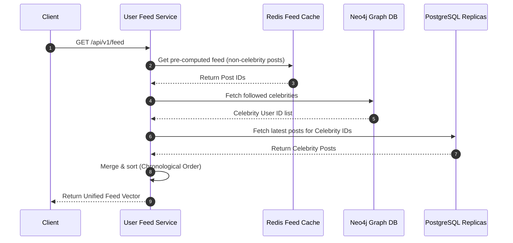

# Scaling Notes: Instagram Media & Feed Subsystems

Designing Instagram for 500 million Daily Active Users (DAU) requires partitioning the write and read paths to handle 1,150 writes/second and 115,000 reads/second.

---

## 1. Media Upload & Blob Storage Optimization

To reliably ingest 95 Terabytes of daily media data (approx. 100 million uploads/day):

### Chunked Streaming & Multi-part S3 Strategy
When a client uploads a file exceeding **5 MB**:
1. The **Post Service** establishes a multi-part session.
2. The client splits the binary stream into chunk arrays and uploads them in parallel directly to an **Amazon S3 Raw Bucket** via presigned URLs.
3. This prevents connection dropouts on mobile networks and enables chunk-level retries.
4. Once all parts upload, S3 merges the chunks.

### CDN & Caching Delivery
1. An S3 validation webhook triggers media analysis (format transcoding, compression, and malware scanning).
2. The optimized media is stored in the **Production S3 Bucket**.
3. A **Content Delivery Network (CDN)** like **Amazon CloudFront** caches these static media resources at edge locations globally to reduce retrieval latency.

---

## 2. Decoupled Ingestion Architecture (Kafka Pipeline)

After writing the metadata transaction to the master PostgreSQL DB, the system avoids synchronous operations. The Post Service publishes a message to **Apache Kafka** on a topic like `posts-ingested`:

```
[Post Service] ──(Publish Event)──> [Apache Kafka: posts-ingested]
                                            │
        ┌───────────────────────────────────┼──────────────────────────────────┐
        ▼                                   ▼                                  ▼
 [Neo4j Graph Engine]             [Elasticsearch Consumer]          [User Feed Service]
 (Update follow graphs)           (Index hashtags & captions)       (Timeline pre-computation)
```

### Async Consumers
* **Search Engine (Elasticsearch)**: Ingests the post details and indexes captions and hashtags using a Lucene inverted index structure.
* **Graph Engine (Neo4j)**: Evaluates user connections and paths to update graph search metrics or recommender graphs.
* **User Feed Service**: Determines the fan-out behavior for timeline updates.

---

## 3. Hybrid Timeline Fan-Out Strategy

To solve the celebrity problem, Instagram balances the Push vs. Pull models dynamically based on user follower counts.

| Property | Fan-Out on Write (Push) | Fan-Out on Read (Pull) |
| :--- | :--- | :--- |
| **Architectural Flow** | When a user posts, we fetch their followers list and write the post ID directly to every follower's pre-computed inbox cache. | The post sits static in the primary database. The system fetches the post dynamically when a follower reads their feed. |
| **Target Audience** | Standard users with a low-to-medium follower count ($< 25,000$ followers). | High-volume celebrity accounts with large follower pools (e.g., millions of followers). |
| **System Trade-offs** | **Pros**: Feed retrieval is $O(1)$ read-heavy from Redis. **Cons**: High write amplification if a user has many followers. | **Pros**: Saves significant compute/storage for inactive followers. **Cons**: High latency on reading if many celebrities are followed. |

---

## 4. Timeline Assembly Flow (Read Path)

When a user requests their feed (`GET /api/v1/feed`), the **User Feed Service** executes the following steps:



1. **Redis Cache Read**: Query the user's pre-computed timeline cache (Redis) containing posts from standard users they follow.
2. **RPC to Neo4j**: Query Neo4j to find which followed accounts are flagged as "Celebrities" ($>25,000$ followers).
3. **PostgreSQL Celebrity Read**: Query the PostgreSQL replicas to retrieve the latest posts from those celebrity IDs.
4. **Merge and Sort**: Perform a merge-sort on the cached feed list and the celebrity posts in reverse-chronological order.
5. **Serialize**: Return the final timeline vector to the client.
