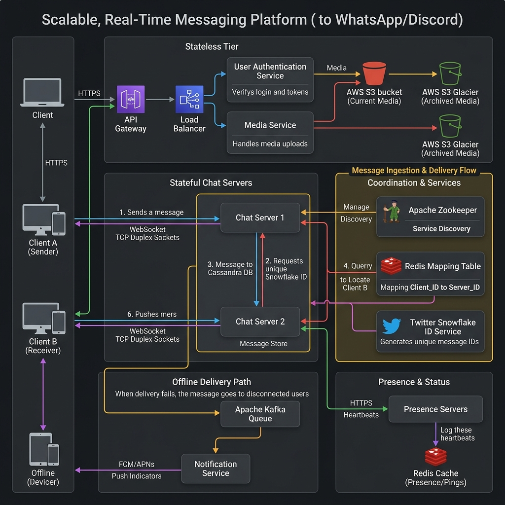
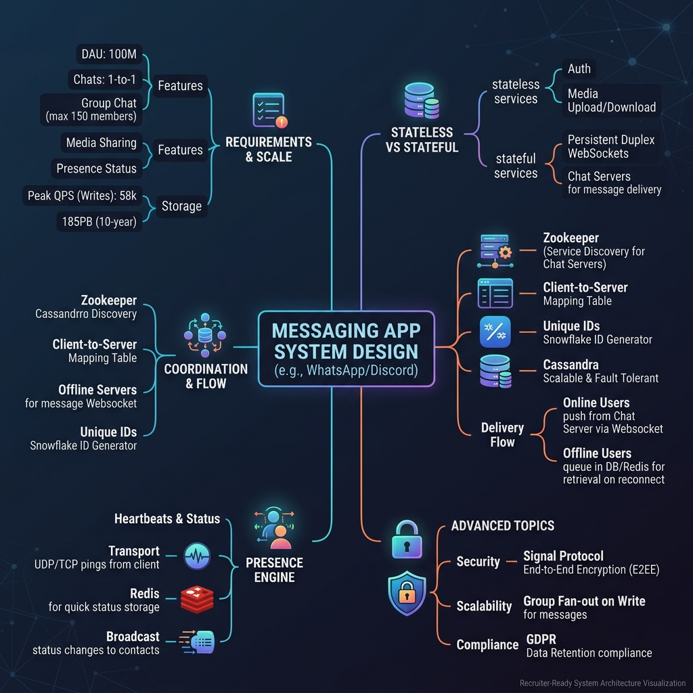
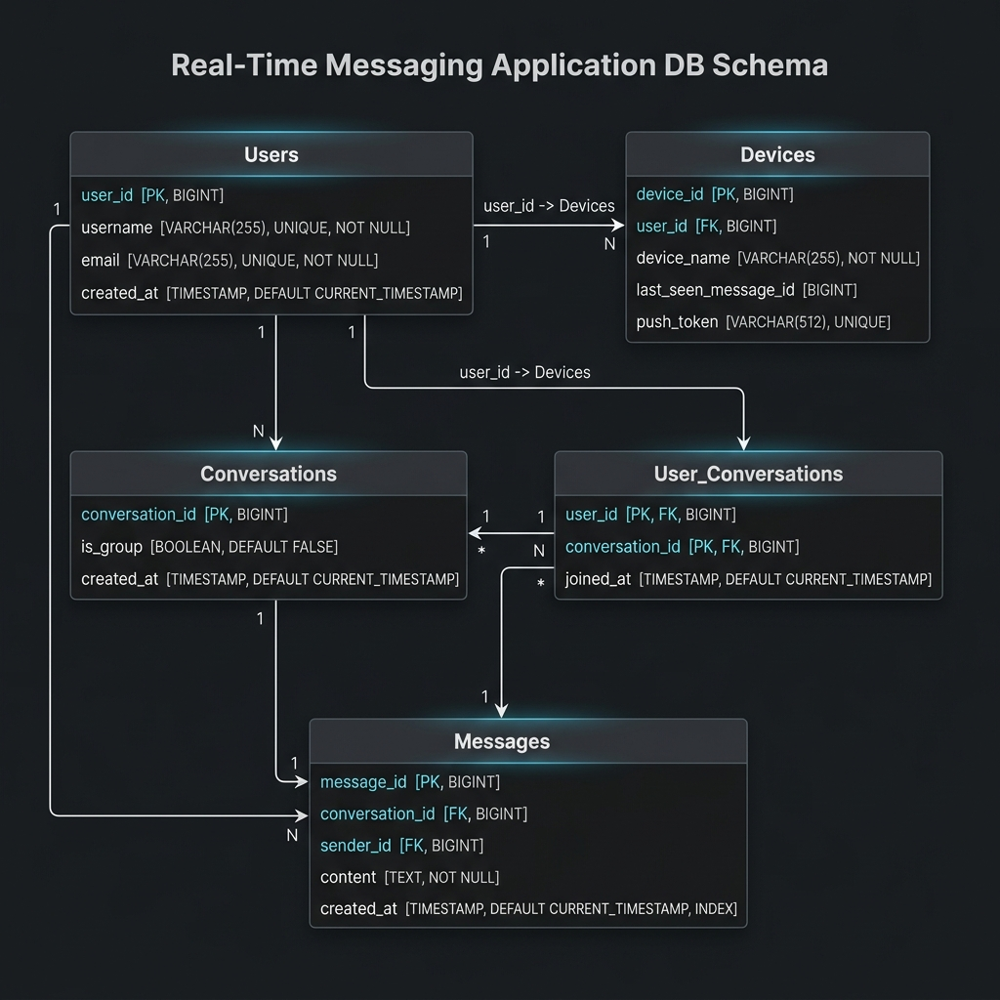

# System Design: Messaging App (WhatsApp/Discord)

This is a comprehensive, production-grade system design specification for a real-time messaging application like WhatsApp, WeChat, or Discord. It is structured to follow professional engineering portfolio guidelines.

---

## 1. Problem Statement

A real-time messaging application enables users to send text messages and media file attachments instantly to individual contacts or group channels. Designing this at scale requires coordinating persistent WebSocket connections across servers and routing messages efficiently.

### Scale of System
* **Daily Active Users (DAU)**: 100 Million
* **Throughput**: 5 Billion messages/day ($\approx 58,000\text{ write QPS}$)
* **Design Horizon**: 10 years of continuous data retention

---

## 2. Functional Requirements

* **1-to-1 Private Chats**: Deliver messages between two users instantly.
* **Group Chats**: Support conversations with up to 150 participants.
* **Media Sharing**: Support image and video file attachments.
* **Offline Delivery**: Deliver push notifications when a user is offline.
* **Real-time Presence**: Display online/offline indicators for contacts.

---

## 3. Non-Functional Requirements

* **Ultra-Low Latency**: Text message delivery must complete in sub-second timelines.
* **Highly Available**: Chat services must remain operational during node failures.
* **Scalability**: Handle massive concurrent WebSocket connections globally.
* **End-to-End Security**: Support encrypted communication channels.

---

## 4. Capacity Estimation

### Request Volume Calculations
* **Daily Messages**: 5 Billion (assuming 50 messages/active user/day)
* **Average Write Throughput**:
  $$5,000,000,000 \div (24\text{ hours} \times 3600\text{ seconds}) \approx 57,870\text{ writes/sec} \approx 58,000\text{ QPS}$$

### Storage Sizing
* **Daily Text Data**: 5 Billion messages * 150 Bytes = **750 Gigabytes/day**
* **Daily Media Data**: 500 Million files * 100 KB = **50 Terabytes/day** (assuming 10% of messages contain media)
* **10-Year Storage Footprint**:
  $$(750\text{ GB/day} + 50\text{ TB/day}) \times 365\text{ days/year} \times 10\text{ years} \approx 185.27\text{ Petabytes} \approx 185\text{ Petabytes}$$

---

## 5. High-Level Design

The architecture splits its operations into stateless API servers for user metadata, stateful WebSocket servers to manage persistent connections, and Presence servers to track heartbeats.

### System Architecture Topology


### Mindmap Breakdown


---

## 6. Database Design

We track relational user graphs and device maps in a PostgreSQL database, while using Cassandra to store message history.

### Database Schema Table Definition


```sql
CREATE TABLE users (
    user_id BIGINT PRIMARY KEY,
    username VARCHAR(255) UNIQUE NOT NULL,
    email VARCHAR(255) UNIQUE NOT NULL,
    created_at TIMESTAMP DEFAULT CURRENT_TIMESTAMP
);

CREATE TABLE devices (
    device_id BIGINT PRIMARY KEY,
    user_id BIGINT REFERENCES users(user_id),
    device_name VARCHAR(255) NOT NULL,
    last_seen_message_id BIGINT,
    push_token VARCHAR(512) UNIQUE
);

CREATE TABLE conversations (
    conversation_id BIGINT PRIMARY KEY,
    is_group BOOLEAN DEFAULT FALSE,
    created_at TIMESTAMP DEFAULT CURRENT_TIMESTAMP
);

CREATE TABLE user_conversations (
    user_id BIGINT REFERENCES users(user_id),
    conversation_id BIGINT REFERENCES conversations(conversation_id),
    joined_at TIMESTAMP DEFAULT CURRENT_TIMESTAMP,
    PRIMARY KEY (user_id, conversation_id)
);
```

---

## 7. Deep-Dive Design Specifications

To read the modular design details, please refer to the corresponding sub-specifications:

* 📄 **[API Interface Contracts](file:///Users/shriyashsahu/.gemini/antigravity/scratch/System-Design/Messaging%20App:%20System%20Design/api-design.md)**: Specifications for WebSocket frames, UDP heartbeats, and REST media upload.
* 📄 **[Stateful Sockets & Routing](file:///Users/shriyashsahu/.gemini/antigravity/scratch/System-Design/Messaging%20App:%20System%20Design/scaling-notes.md)**: WebSocket persistent connections, Snowflake ID generators, Redis mapping tables, and presence pings.
* 📄 **[Bottlenecks & Tradeoffs Analysis](file:///Users/shriyashsahu/.gemini/antigravity/scratch/System-Design/Messaging%20App:%20System%20Design/tradeoffs.md)**: In-depth assessment of WebSockets vs. Long Polling, Cassandra vs. Relational datastores, and group chat fan-out optimization limits.

---

## 8. Technologies Used

* **Stateful Chat Servers**: Go / C++ (High I/O performance on concurrent networking sockets).
* **Stateless API Tiers**: FastAPI (Python) (Authentication, user profile configurations).
* **Distributed Coordinator**: Apache Zookeeper (Tracks active chat server nodes).
* **Distributed Session Store**: Redis Cluster (Matches Client_ID to active Chat Server_ID).
* **Message Storage Database**: Apache Cassandra (High write-throughput logs).
* **Search / Analytics Queue**: Apache Kafka (Handles offline event routing).
* **Object Store**: Amazon S3 / S3 Glacier (Binary media assets storage).

---

## 9. Key Learnings & Lessons Learned

1. **WebSockets for Duplexing**: Standard HTTP lacks the bidirectional capability needed for real-time chat. WebSockets reduce protocol overhead and minimize latency.
2. **Heartbeats Reduce Socket Noise**: Tracking presence using TCP connection events is unreliable. Firing lightweight UDP heartbeats every 5 seconds avoids connection spikes and tracks network changes accurately.
3. **Decouple Ingest from Delivery**: Writing messages to Cassandra before routing them ensures durability. Using a session mapping table to route messages prevents network loops.
4. **Snowflake Unique ID Sequencing**: Twitter's Snowflake algorithm provides time-sorted unique IDs without database bottlenecks, allowing clients to detect missed messages.
