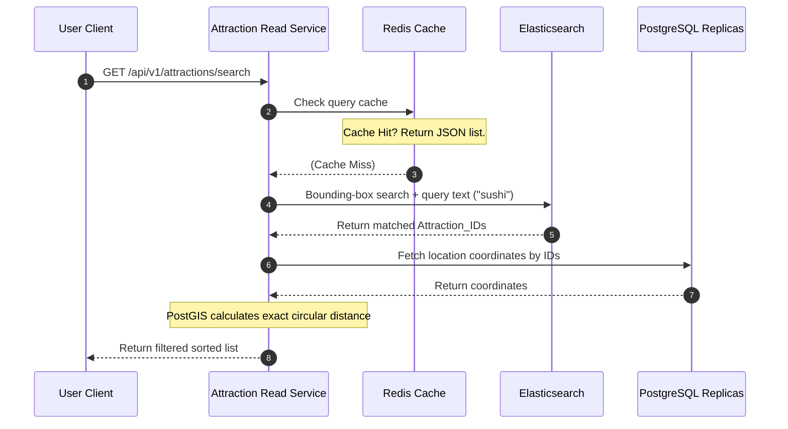

# Scaling Notes: Geospatial Query & Ingestion Pipeline

To support 385,000 read QPS against millions of physical attractions alongside high-volume reviews (38.5 writes/sec avg), the Proximity Service segregates operations into discrete geospatial pipelines.

---

## 1. Core Geospatial Indexing: Geohashing

Traditional B-tree indexes are one-dimensional and cannot evaluate two-dimensional spatial constraints (e.g., finding points where $X_{min} \le X \le X_{max}$ AND $Y_{min} \le Y \le Y_{max}$) efficiently under high loads.

### Geohash Mechanism
Geohashing translates a 2D coordinate point (latitude, longitude) into a single base32 alphanumeric string (composed of characters `0-9` and `a-z` excluding `a`, `i`, `l`, `o` to avoid readability confusion). The Earth is recursively split into grid quadrants, with each character adding precision.

* **Precision Ranges**:
  * **6 characters**: $\approx 1.2\text{ km} \times 0.6\text{ km}$ grid cell. Ideal for regional queries.
  * **7 characters**: $\approx 150\text{ meters} \times 150\text{ meters}$ grid cell.
  * **8 characters**: $\approx 38\text{ meters} \times 19\text{ meters}$ grid cell. Ideal for dense urban area lookups.

### Query Strategy via Prefix Matching
Geohashing is highly indexable. To find nearby spots, the system calculates the user's geohash and queries database records using string prefix matching:
```sql
SELECT * FROM attractions WHERE geohash LIKE '9q8yyz%';
```
This reduces search space down to a single grid cell and its 8 surrounding neighbors (to resolve boundary cases), transforming a complex 2D scan into a simple string search.

---

## 2. Decoupled Write Pipeline (Ingestion Path)

Because business locations are updated rarely ($\approx 1,000$ new additions/day globally), writes are structured to ensure metadata durability and sync indexing.

```
[Business Client] ──> [API Gateway (Rate Limiting)]
                            │
              [Attraction Write Service]
              ┌─────────────┴─────────────┐
              ▼                           ▼
      [Amazon S3] (Images)       [PostgreSQL Master + PostGIS] (Geohash)
                                          │
                                   (Publish Event)
                                          ▼
                                   [Apache Kafka]
                                   ┌──────┴──────┐
                                   ▼             ▼
                             [DynamoDB]     [Elasticsearch]
                            (Flex Attributes) (Inverted Index)
```

1. **Rate Limiting**: Land on Nginx/Kong API Gateway using a **Token Bucket** algorithm to prevent write bursts.
2. **Media Storage**: Stream photos to **Amazon S3** which triggers edge invalidation across **CloudFront CDN**.
3. **Database Write**: Compute the Geohash from coordinate inputs and write the business row atomically to the **PostgreSQL Master** database.
4. **Asynchronous Indexing**: Publish a `business-created` message to **Apache Kafka**. Background worker nodes pick up the message and replicate attributes to **Elasticsearch** (for keyword matching) and **DynamoDB** (for flexible business details like hours of operation).

---

## 3. High-Throughput Read Pipeline (Search Path)

To handle 385,800 reads/second with low latencies:



1. **Redis Checking**: Check if the query coordinates mapping to a geohash prefix exist inside the **Redis Cache** cluster.
2. **Elasticsearch Filtering**: On a cache miss, query Elasticsearch using coordinates mapped to a bounding box box alongside search keywords. Elasticsearch returns matching **Attraction_IDs**.
3. **Replica Fetch & PostGIS Distance check**: Retrieve details for these Attraction_IDs from **PostgreSQL Read Replicas**. The database's **PostGIS extension** performs high-speed exact coordinate checks to filter out locations outside the exact query radius.
4. **Serialization**: Return the response payload to the client.

---

## 4. Review Ingestion Pipeline (Write-Heavy)

User reviews and ratings are written frequently (38.5 QPS average, with peaks of thousands of QPS). Writing these reviews directly to PostgreSQL would create a bottleneck.

* **Bypassing the RDBMS**: Review submissions bypass the PostgreSQL relational cluster completely.
* **NoSQL Database Ingestion**: The **Review Service** writes reviews directly into **Apache Cassandra** or **Amazon DynamoDB**, which are partitioned horizontally by `attraction_id`.
* **Redis Caching for Ratings**: An async background worker aggregates scores and updates the average star rating and review count of the attraction inside **Redis** to ensure fast preview generation.
