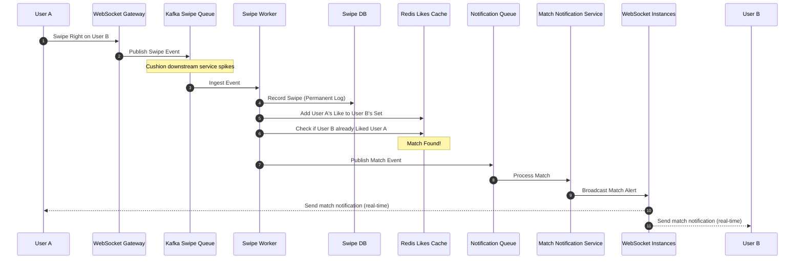

# Scaling Notes: S2 Geometry & Bidirectional Match Loop

To scale discovery decks and swiping events for millions of concurrent users, the Tinder subsystem employs Google S2 geospatial sharding and asynchronous match evaluation queues.

---

## 1. Geo Sharding with Google S2 Geometry

Traditional spatial search checks (like radial bounding circles) fail at scale if millions of coordinates are stored on a single database. Tinder partitions profiles into regional Elasticsearch nodes using **Google S2 Geometry**.

### The Hilbert Curve & S2 Cells
1. **Hilbert Space-Filling Curve**: S2 utilizes a Hilbert Curve to map a spherical surface into a one-dimensional linear line. If two points sit close on the 1D Hilbert line, they are guaranteed to sit close in 2D physical geographic space.
2. **Hierarchical Quadtree Grid**: S2 projects the Earth onto a cube. Each face is divided into hierarchical cell grids (Levels 0 to 30).
3. **Dynamic Hot-Spot Balancing**:
   * S2 cells vary in level. Level 12 cells average $3.1\text{ km}^2$.
   * In unpopulated areas, the system clusters multiple broad S2 cell listings together.
   * In dense urban centers (e.g., Tokyo or Manhattan), cells are subdivided into Level 14 or 15 grids ($O(100\text{ meters})$).
   * **Result**: Each database shard holds roughly the same profile count, preventing hotspotting.

```
[Earth Globe] ──> [S2 Projection] ──> [Hilbert Space-Filling Curve (1D String)]
                                             │
                   ┌─────────────────────────┴─────────────────────────┐
                   ▼                                                   ▼
       [Dense Urban: New York]                             [Rural: Nebraska]
       (Granular Level 15 Sub-cells)                       (Broad Level 10 Cells)
       [Node A: Elasticsearch Geo Shard]                   [Node B: Elasticsearch Geo Shard]
```

---

## 2. Ingestion & Discovery Data Flow

### Profile Ingestion & Geo Shard Writing
1. A user updates their profile or logs in.
2. The User Profile Service computes their Google S2 cell assignment based on coordinates.
3. The event publishes to **Apache Kafka**.
4. Workers verify the target cell mapping in **Redis** and index the profile document directly into the designated **Elasticsearch Geo Shard** corresponding to that regional cell.

### Discovery Deck Compilation
```
User Client ──> [Recommendation Service]
                       │
       ┌───────────────┴───────────────┐
       ▼                               ▼
[Location Service]             [Swipe Database]
(Find S2 cell overlaps         (Pull list of all
within 100-mile circle)         user swiped IDs)
       │                               │
       └───────────────┬───────────────┘
                       ▼
         [Query target Geo Shards]
       (Skip other irrelevant shards)
```

1. **Calculate S2 cells**: The Location Service finds all S2 cells overlapping the user's 100-mile query radius.
2. **Shard Targeting**: The Recommendation Service queries only the Elasticsearch Geo Shards matching those S2 cells, ignoring all other global nodes.
3. **Swipe Filtering**: The engine joins the results with historical swiped profiles from the **Swipe DB** and filters out previously evaluated profiles.

---

## 3. Real-Time WebSocket Swiping & Match Loop

Swiping throughput exhibits massive write spikes. Direct database matches create locks. Tinder resolves matches in-memory using **WebSockets** and **Redis**.



### Kafka Buffer & Dead Letter Queues (DLQ)
* **Kafka Swipe Queue**: Acts as a buffer to protect downstream components from swipe surges.
* **Dead Letter Queue (DLQ)**: If a swipe event fails due to a network timeout or data formatting error, it is automatically routed to a DLQ for offline analysis, ensuring the primary matching pipeline is not blocked.

### Redis Likes Cache
Each user has a Redis Set containing the IDs of accounts they liked. When User A likes User B:
1. User A's ID is added to User B's `liked_by` Redis Set.
2. The worker checks if User B's ID is in User A's `liked_by` Redis Set.
3. If yes, it is a match, triggering a push event to the WebSocket instances.
