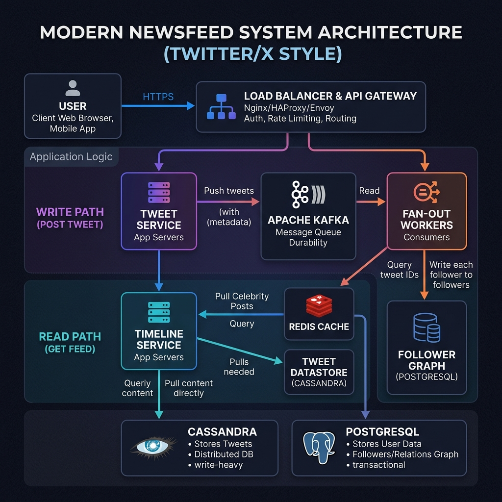
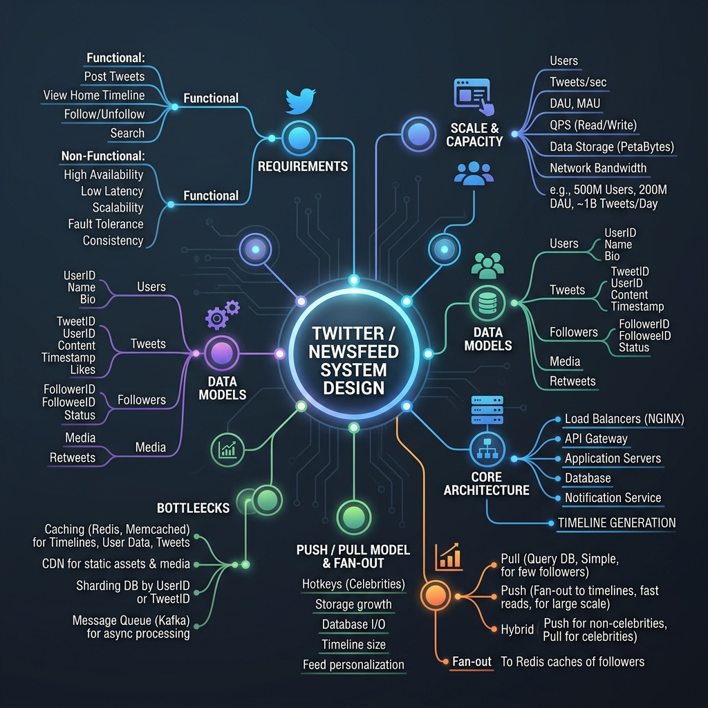
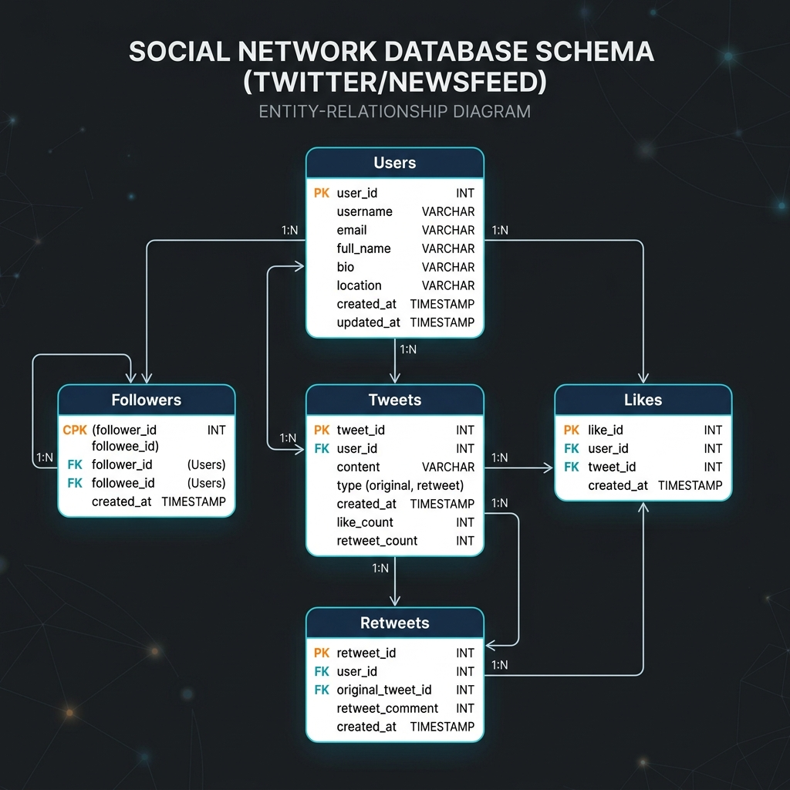

# System Design: Twitter / Newsfeed

This is a comprehensive, production-grade system design specification for a distributed Twitter-like Newsfeed service. It is structured to follow professional engineering portfolio guidelines.

---

## 1. Problem Statement

A Newsfeed system collects updates (tweets, posts) from people you follow and compiles them into a unified feed chronologically. Designing this at global scale requires coordinating sequence numbering across stateless servers without centralization bottlenecking.

### Scale of System
* **Total Registered Users**: 500 Million
* **Daily Active Users (DAU)**: 200 Million
* **Write Generation Volume**: 400 Million tweets/day ($\approx 4,630\text{ tweets/sec}$)
* **Read Redirection Volume**: 2 Billion home timeline requests/day ($\approx 23,150\text{ reads/sec}$)

---

## 2. Functional Requirements

* **Post Tweets**: Publish text and media posts.
* **Follow/Unfollow**: Establishes link relationships between users.
* **View Timeline**: Retrieve a personalized timeline containing tweets from followings (Home Timeline) and a specific user's posts (User Timeline).
* **Like and Retweet**: Register likes and retweets on posts.
* **Search**: Perform full-text search across tweets.
* **Notifications**: Notify users when they are followed or mentioned.

---

## 3. Non-Functional Requirements

* **Ultra-Low Read Latency**: Home timeline generation must complete in sub-200ms.
* **Highly Available**: The feed must prioritize availability over absolute real-time updates (AP model).
* **Scalability**: Must scale gracefully during high-write celebrity events.
* **Eventual Consistency**: It is acceptable for followers to receive feed updates with a slight lag (propagation latency).

---

## 4. Capacity Estimation

### Request Volume Calculations
* **Writes per day**: $400\text{ Million tweets/day}$
* **Writes per second**:
  $$400\text{M} \div 86,400\text{ sec/day} \approx 4,630\text{ writes/sec (average)}$$
  $$\text{Peak writes (2x average)} \approx 9,260\text{ writes/sec}$$
* **Reads per day**: $2\text{ Billion reads/day}$
* **Reads per second**:
  $$2\text{B} \div 86,400\text{ sec/day} \approx 23,150\text{ reads/sec (average)}$$
  $$\text{Peak reads (2x average)} \approx 46,300\text{ reads/sec}$$

### Storage Calculations
* Let average database record footprint (Tweet ID, User ID, Content, Media URLs, Timestamps) = **500 Bytes**.
* **Daily Storage Growth**:
  $$400\text{M writes/day} \times 500\text{ bytes} \approx 200\text{ Gigabytes/day}$$
* **Annual Storage Growth**:
  $$200\text{ GB/day} \times 365\text{ days/year} \approx 73\text{ Terabytes/year}$$

---

## 5. High-Level Design

The architecture decouples the write ingest pathway from the read timeline generation pathway. Ingestion writes to Kafka queues, which are consumed by background fan-out workers that update follower Redis caches.

### System Architecture Topology

### Mindmap Breakdown

---

## 6. Database Design

We store immutable tweets in a Cassandra cluster for high write throughput, and relational follow graphs in sharded PostgreSQL instances.

### Database Schema Table Definition

---

## 7. Deep-Dive Design Specifications

To read the modular design details, please refer to the corresponding sub-specifications:

* 📄 **[API Interface Contracts](file:///Users/shriyashsahu/.gemini/antigravity/scratch/System-Design/Twitter%20/%20Newsfeed:%20System%20Design/api-design.md)**: Full REST API specs for tweet creation, timeline fetching, and relationship management.
* 📄 **[Distributed Scaling Strategy](file:///Users/shriyashsahu/.gemini/antigravity/scratch/System-Design/Twitter%20/%20Newsfeed:%20System%20Design/scaling-notes.md)**: Hybrid push/pull fan-out pipelines, Redis caching, database sharding, and Elasticsearch integration.
* 📄 **[Bottlenecks & Tradeoffs Analysis](file:///Users/shriyashsahu/.gemini/antigravity/scratch/System-Design/Twitter%20/%20Newsfeed:%20System%20Design/tradeoffs.md)**: In-depth assessment of Push vs. Pull models, Graph vs. SQL databases, eventual consistency, and eviction policies.

---

## 8. Technologies Used

* **Frontend**: Next.js (Visual user interface, web app console).
* **Backend**: FastAPI (Python) or Go (Stateless, high-throughput REST application servers).
* **Message Broker**: Apache Kafka (Buffers tweet ingestion and decouples fan-out queues).
* **Distributed Cache**: Redis Cluster (In-memory cached lists for active user timelines).
* **Write Datastore**: Apache Cassandra (Wide-Column NoSQL, write-heavy storage).
* **Relational Datastore**: Sharded PostgreSQL (Stores structured user profiles and social graphs).
* **Search Engine**: Elasticsearch (Indices text for real-time keyword/hashtag lookups).
* **Object Store**: Amazon S3 (Houses raw media assets and image/video uploads).

---

## 9. Key Learnings & Lessons Learned

1. **Decouple Ingest from Delivery**: Writing tweets to a buffer queue (Kafka) protects database engines from peak spikes and lets workers process feed distribution asynchronously.
2. **Hybrid Fan-Out is Essential**: A pure push model fails for celebrities. Using a push model for standard accounts and a pull/merge model for celebrities balances write performance and read latency.
3. **Optimistic Feeds via Caching**: Restricting timeline caches to active users (logged in within 3 days) reduces memory expenses while maintaining fast load speeds for the majority of traffic.
4. **Relational Graph Sharding**: PostgreSQL is excellent for handling 1-hop social relations, provided sharding keys are mapped logically (partitioned by `user_id`).
