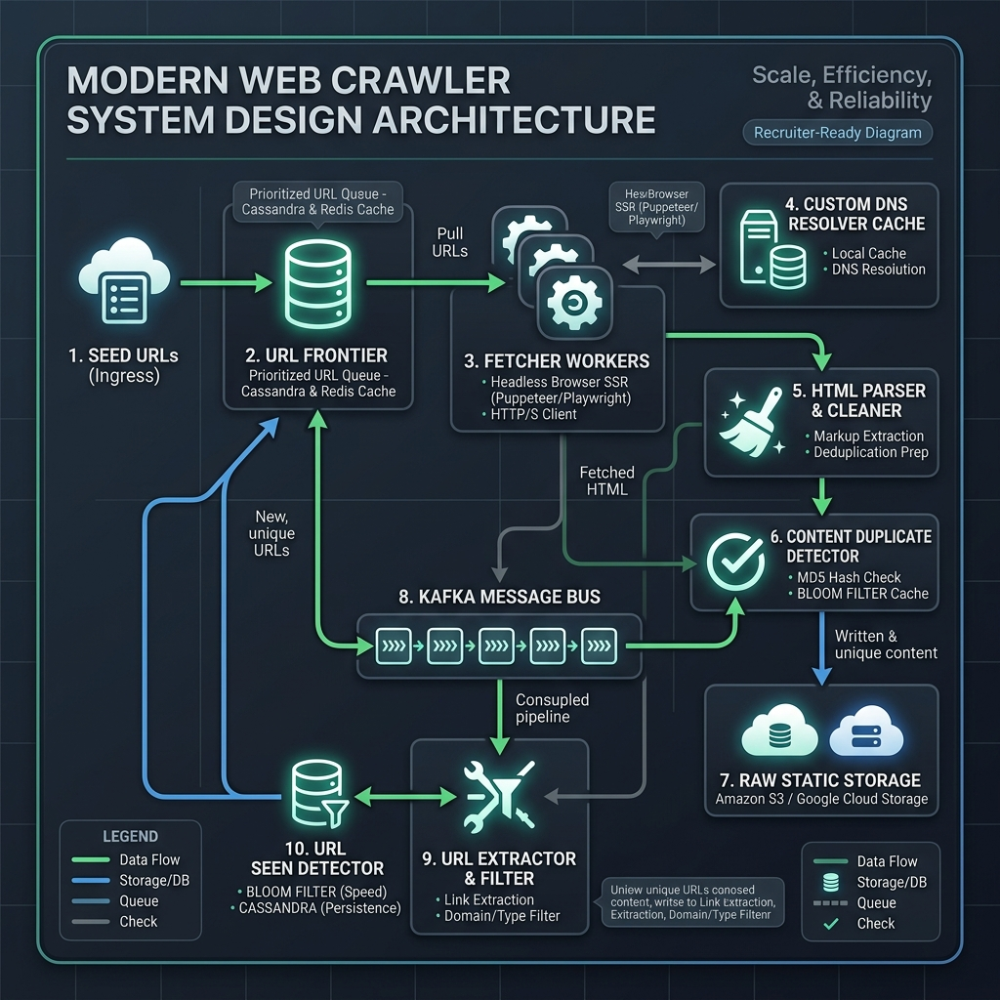
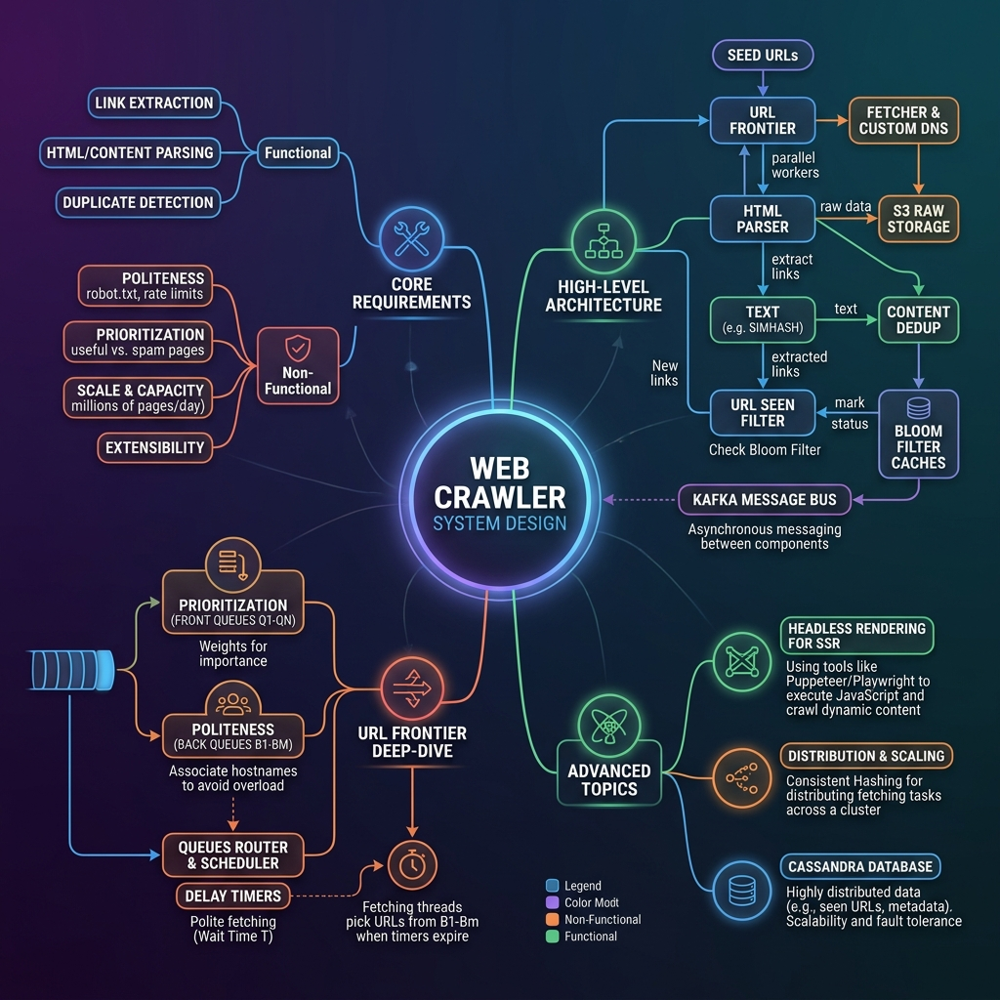
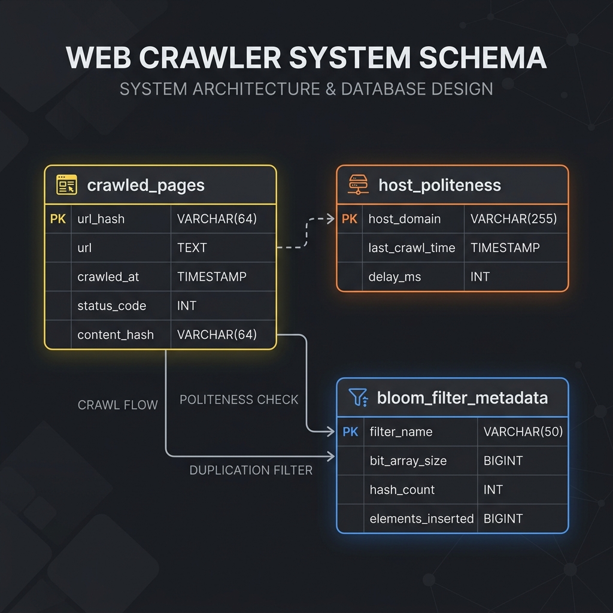

# System Design: Web Crawler

This is a comprehensive, production-grade system design specification for a distributed Web Crawler (also known as a spider or bot). It is structured to follow professional engineering portfolio guidelines.

---

## 1. Problem Statement

A Web Crawler systematically browses the World Wide Web to download, parse, and archive pages. It is commonly used for search engine indexing (Google, Bing), market research data mining, and web archiving (The Wayback Machine).

### Scale of System
* **Crawl Volume**: 1 Billion web pages per month
* **Crawl Throughput**: $\approx 386\text{ pages/sec}$ average crawl speed
* **Data Retention Window**: 5-year retention horizon

---

## 2. Functional Requirements

* **Seed Ingestion**: Crawl systematically starting from a provided list of Seed URLs.
* **Link Extraction**: Parse web pages to extract hyperlinks and expand the crawl scope.
* **Deduplication**: Detect and discard duplicate content and visited URLs.
* **Malformed HTML Correction**: Parse and repair broken or malformed markup rather than discarding pages.

---

## 3. Non-Functional Requirements

* **Politeness**: Enforce crawl delay rules to avoid overloading target web servers (respecting robots.txt).
* **Prioritization**: Crawl high-value, active pages (e.g. PageRank-weighted) first.
* **Scalability**: Handle massive read/write volumes across a distributed cluster of worker nodes.
* **Extensibility**: Support new file formats and analytical plugin components.

---

## 4. Capacity Estimation

### Request Volume Calculations
* **Monthly Crawl Volume**: 1 Billion pages
* **Crawl QPS (Average)**:
  $$1,000,000,000 \div (30\text{ days} \times 86,400\text{ sec/day}) \approx 386\text{ pages/sec}$$
* **Peak Crawl QPS (2x average)**: $\approx 772\text{ pages/sec}$

### Storage Sizing
* Let the average web page size (inclusive of text and assets) = **2.5 MB**.
* **Monthly Storage Growth**:
  $$10^9\text{ pages} \times 2.5\text{ MB} = 2.5\text{ Petabytes/month}$$
* **Annual Storage Growth**:
  $$2.5\text{ PB/month} \times 12\text{ months} = 30\text{ Petabytes/year}$$
* **5-Year Data Retention Storage**:
  $$30\text{ PB/year} \times 5\text{ years} = 150\text{ Petabytes}$$

---

## 5. High-Level Design

The system decouples page fetching, content extraction, and URL queue scheduling using Apache Kafka message buses. Fetcher workers pull from the URL Frontier and output raw HTML to Kafka queues, which feed extraction and duplicate filters.

### System Architecture Topology


### Mindmap Breakdown


---

## 6. Database Design

We track page crawl logs and domain politeness rates inside a highly scalable wide-column NoSQL Cassandra cluster. Memory-resident Bloom Filters handle instant deduplication queries.

### Database Schema Table Definition


```sql
CREATE KEYSPACE crawler_keyspace 
WITH replication = {'class': 'NetworkTopologyStrategy', 'us-east': 3, 'us-west': 3};

CREATE TABLE crawler_keyspace.crawled_pages (
    url_hash text,
    url text,
    crawled_at timestamp,
    status_code int,
    content_hash text,
    PRIMARY KEY (url_hash)
);

CREATE TABLE crawler_keyspace.host_politeness (
    host_domain text,
    last_crawl_time timestamp,
    delay_ms int,
    PRIMARY KEY (host_domain)
);
```

---

## 7. Deep-Dive Design Specifications

To read the modular design details, please refer to the corresponding sub-specifications:

* 📄 **[API Interface Contracts](file:///Users/shriyashsahu/.gemini/antigravity/scratch/System-Design/Web%20Crawler:%20System%20Design/api-design.md)**: Specifications for seed ingestion, status telemetry, and resolver caches.
* 📄 **[URL Frontier & Queue Scheduling](file:///Users/shriyashsahu/.gemini/antigravity/scratch/System-Design/Web%20Crawler:%20System%20Design/scaling-notes.md)**: In-depth queue layouts, politeness delay selectors, Bloom filters, and headless SSR scaling.
* 📄 **[Bottlenecks & Tradeoffs Analysis](file:///Users/shriyashsahu/.gemini/antigravity/scratch/System-Design/Web%20Crawler:%20System%20Design/tradeoffs.md)**: Comparisons of SQL vs NoSQL, fingerprinting algorithms, and SSR processing latency costs.

---

## 8. Technologies Used

* **Stateless Fetchers**: Go / C++ (High performance, concurrent networking).
* **Distributed Queue**: Apache Kafka (Decouples HTML fetchers from link parsers).
* **Distributed Cache**: Redis Bloom (Space-efficient, high-speed visited check).
* **Persistent Metadata Storage**: Apache Cassandra (High write-throughput logs).
* **Distributed File System**: Amazon S3 (Houses raw page markup and static assets).
* **Headless Rendering Pool**: Puppeteer/Playwright running inside Docker clusters for JavaScript SSR rendering.
* **DNS Caching Resolver**: Custom local CoreDNS configurations.

---

## 9. Key Learnings & Lessons Learned

1. **Decouple Fetching from Extraction**: Buffering fetched HTML into a message bus (Kafka) prevents slower extraction operations from throttling the network fetcher threads.
2. **Prioritization + Politeness Split**: URL Frontier requires isolating priorities (Front Queues) from domain locking (Back Queues) to achieve balanced crawl depth without rate-limiting target hosts.
3. **Headless Execution Bottlenecks**: Modern JavaScript-heavy sites demand headless browsers, which require orders of magnitude more CPU/RAM than standard static GET fetches.
4. **Bloom Filters Save Millions**: Visited URL indexes are too massive for RAM. Bloom filters reduce RAM usage by ~95% compared to Hash Sets, with a negligible false positive rate.
